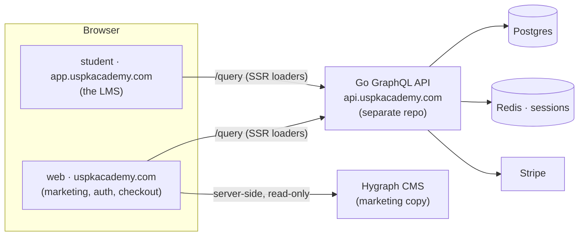

# USPK Academy — Frontend Monorepo

Online course platform (LMS). This repo holds the **two frontends** and the
**shared packages**. The GraphQL API is a **separate Go repo** (see below).

> New here? Read this top-to-bottom, then ask the CTO for the `.env` values and
> access (Vercel, Hygraph, Stripe, the VPS). Nothing secret lives in git.

---

## Architecture



- **`apps/web`** — marketing site + **auth** (login/signup/Google) + cart + checkout + memberships. Content is **Hygraph-driven** (CMS). Has PostHog analytics. Lives on the apex `uspkacademy.com`.
- **`apps/student`** — the actual LMS (dashboard, course viewer, quizzes, certificates). API-driven, **no CMS**. Lives on `app.uspkacademy.com`.
- **Go API** (separate repo, sibling `../server`) — GraphQL (gqlgen), Postgres, Redis (sessions + OAuth state), Stripe, Google OAuth, email (Resend), media (Cloudinary / DO Spaces).
- **Hygraph** — headless CMS for marketing copy only. Read server-side; the token never reaches the browser.

Both apps are **React Router v7 (framework mode, SSR)** — loaders/actions run on the server, `:lang`-prefixed routes for i18n (`es` / `en`), branded `ErrorBoundary`.

---

## Repo layout

```text
apps/
  web/        marketing + auth + checkout   (uspkacademy.com)
  student/    the LMS                        (app.uspkacademy.com)
packages/
  courses-api/   gql.tada client to the Go API (schema in src/graphql/schema.graphql)
  cms/           gql.tada client to Hygraph (server-only)
  graphql-utils/ shared urql client factory
  user-ui/       shared UI, brand components, auth pages, middleware, lib (lang, site-urls, seo)
  student-ui/    student-only UI (certificate PDF, sidebar, …)
```

Tooling: **bun** workspaces + **Turborepo**. Node ≥ 20.

---

## Prerequisites

- [Bun](https://bun.sh) `1.2.x` (package manager + runner)
- Node ≥ 20
- The **Go API** running locally (clone the `server` repo next to this one) — needs **Go 1.24+**, **Postgres**, and **Redis** (Docker is easiest).

---

## Getting started

```bash
# 1. install (from repo root)
bun install

# 2. env: copy each example and fill in the values (ask the CTO)
cp apps/web/.env.example apps/web/.env
cp apps/student/.env.example apps/student/.env

# 3. run everything (both apps) via turbo
bun run dev
```

- **web** → `http://localhost:5173`
- **student** → `http://localhost:5174`
- Both expect the Go API at `http://localhost:4000/query` (default `VITE_API_URL`).

Run a single app instead:

```bash
cd apps/web && bun run dev      # or apps/student
```

---

## Environment variables

Each app has a documented `.env.example` — copy it to `.env` and fill in. Highlights:

| Var | Where | Notes |
|---|---|---|
| `VITE_API_URL` | both | Go API `/query` endpoint. `VITE_*` are **inlined at build** (public). |
| `VITE_PUBLIC_POSTHOG_PROJECT_TOKEN` / `_HOST` | both | Analytics (public token). Web + student share one project. |
| `VITE_STRIPE_PUBLISHABLE_KEY` | web | Publishable (safe in the client). The **secret** key lives only in the Go API. |
| `HYGRAPH_CONTENT_ENDPOINT` / `HYGRAPH_AUTH_TOKEN` | web | **Server-only** (no `VITE_` prefix) — never shipped to the browser. |
| `AUTH_BASE_URL` / `VITE_AUTH_BASE_URL` | student | Where `/login` lives (the web app) — auth is cross-origin from the student app in prod. |

> **Never commit `.env`.** `.env`, `build/`, `node_modules/`, `.react-router/` are gitignored. Only `.env.example` (placeholders) is tracked.

---

## Common commands

```bash
bun run dev         # turbo: run all apps in dev
bun run build       # turbo: production build (react-router build; does NOT typecheck)
bun run typecheck   # turbo: tsc --noEmit across every package
bun run format      # turbo: prettier
```

Package-specific:

```bash
# courses-api: after editing a GraphQL query, regenerate the gql.tada types
cd packages/courses-api && bun run gql:generate   # (schema.graphql must be in sync with the API)
```

---

## Conventions & things to know

- **i18n**: every user route is under `:lang` (`/es/...`, `/en/...`). Marketing copy comes from Hygraph with code-level defaults as fallback (`packages/cms/src/loaders/*`); UI strings are passed as label props, never hardcoded in components.
- **GraphQL**: typed with **gql.tada**. `packages/courses-api` talks to the Go API (its `schema.graphql` mirrors the API); `packages/cms` talks to Hygraph. Data is fetched in **loaders/actions (server-side)** — client-side fetches to the API are rare.
- **Auth / cookies**: session is a `session_token` cookie set by the API. In prod the cookie is scoped to `.uspkacademy.com` (`COOKIE_DOMAIN`) so it's shared across `www` / `app` / `api`. Email+password login flows the cookie through SSR; Google OAuth is a direct API redirect.
- **Course access (paywall)**: lesson video URLs are gated server-side (`Course.hasAccess`) — a user needs an **enrollment** or an **active subscription** (a plan with no category = all courses; otherwise its category). Course **preview** videos are public by design.
- **Styling**: Tailwind + a house design system (brand tokens like `academy-blue`, `shadow-hard-*`, `rounded-card`, the `BrandButton`). Reuse `packages/user-ui` components; keep the look consistent.

### Gotchas

- **Don't run bare `tsc`** — it has no `--noEmit` by default and will scatter compiled `.js` next to every `.ts`. Always use `bun run typecheck` (which passes `--noEmit`).
- The **Go API is a separate repo** — clone it as a sibling (`../server`) and run it (Docker for Postgres/Redis). The frontend can't do much without it.
- **Vite/Vercel builds don't typecheck** — a red `tsc` doesn't block a deploy unless you add typecheck to the build command.

---

## Deploy

- **Apps** → Vercel (one project per app). Set env vars in the Vercel dashboard (they don't come from `.env` files there). Staging is protected via **Vercel Deployment Protection**.
- **Go API** → VPS (dockerized Postgres + Redis). Its env lives on the server, never in git.

---

## Getting help

Ping the CTO (Alvaro). When stuck, include: what you ran, the app/package, and the full error. Welcome aboard. 🚀
